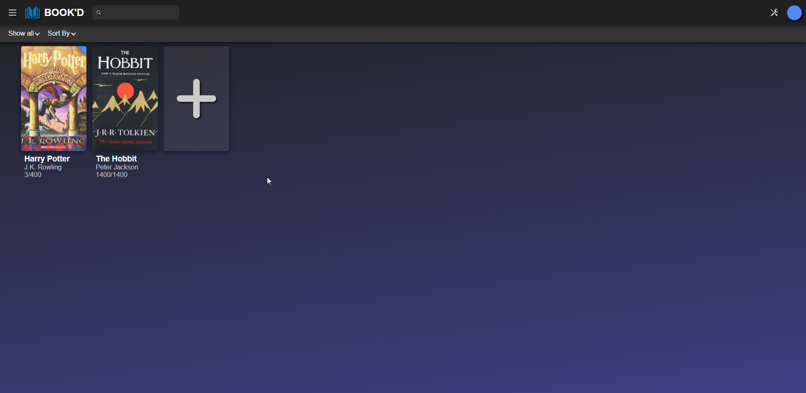

# BOOK-d

## About the Project

This project is based on [the Odin Project](https://www.theodinproject.com/courses/javascript/lessons/library) for the purpose of my own learning JavaScript. 
This project was built from the ground up, with a very obvious inspiration from Plex
The Library is persistent and saved to the browser's 'Local Storage'

## Live Demo

[Live Demo Link](https://drewrox2009.github.io/BOOK-D/)

## Getting Started

No dependencies required to run this project Feel free to clone away.

## Author

👤 **Drew Thompson**

## Contributing

Contributions, issues, and feature requests are welcome!
Feel free to check the [issues page](../../issues).

1. Fork the Project
2. Create your Feature Branch (`git checkout -b feature/AmazingFeature`)
3. Commit your Changes (`git commit -m 'Add some AmazingFeature'`)
4. Push to the Branch (`git push origin feature/AmazingFeature`)
5. Open a Pull Request

## Show your support

Give a ⭐️ if you like this project!

## License

This project is [MIT](./LICENSE) licensed.

## Acknowledgements
* [the Odin Project](https://www.theodinproject.com/courses/javascript/lessons/library)
